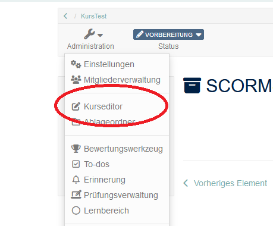
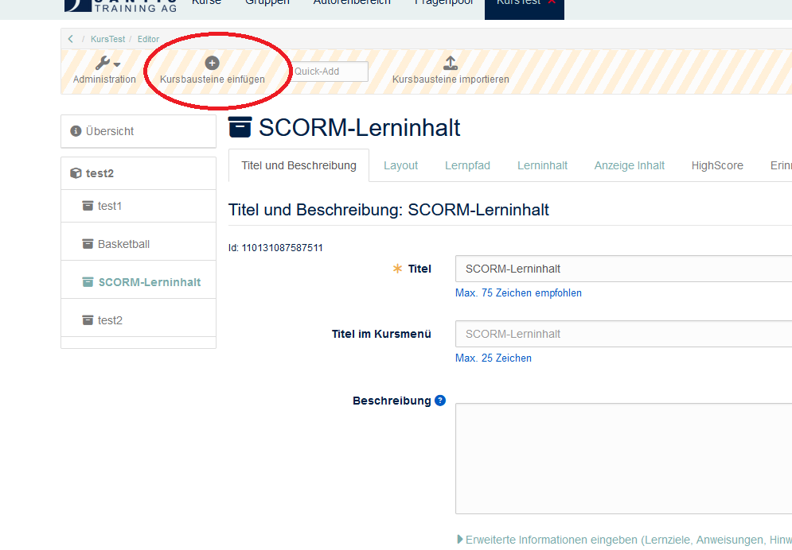
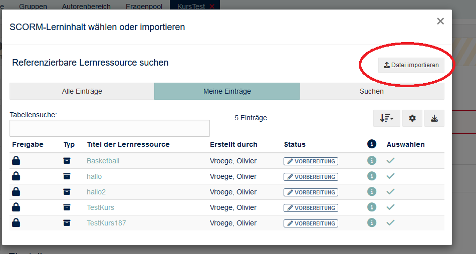
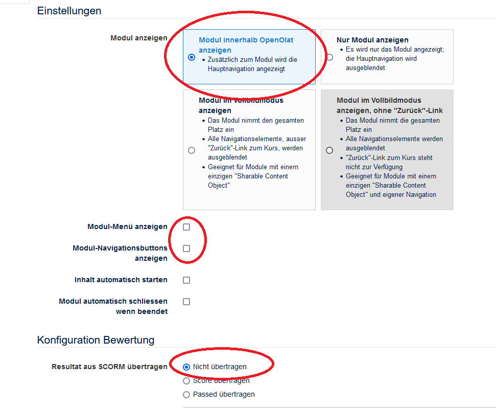
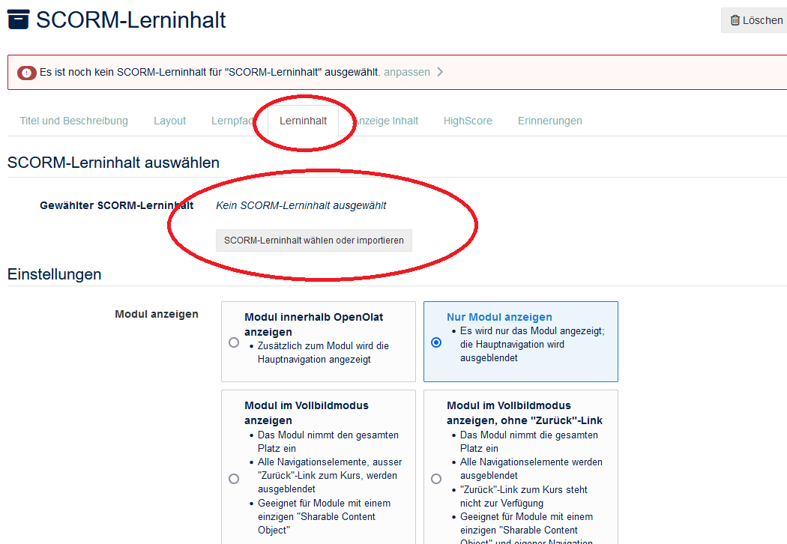

<!--

onload
window.CodeRunner = {
    ws: undefined,
    handler: {},
    connected: false,
    error: "",
    url: "",

    init(url, step = 0) {
        this.url = url
        if (step  >= 10) {
           console.warn("could not establish connection")
           this.error = "could not establish connection to => " + url
           return
        }

        this.ws = new WebSocket(url);

        const self = this
        
        const connectionTimeout = setTimeout(() => {
          self.ws.close();
          console.log("WebSocket connection timed out");
        }, 5000);
        
        
        this.ws.onopen = function () {
            clearTimeout(connectionTimeout);
            self.log("connections established");

            self.connected = true
            
            setInterval(function() {
                self.ws.send("ping")
            }, 15000);
        }
        this.ws.onmessage = function (e) {
            // e.data contains received string.

            let data
            try {
                data = JSON.parse(e.data)
            } catch (e) {
                self.warn("received message could not be handled =>", e.data)
            }
            if (data) {
                self.handler[data.uid](data)
            }
        }
        this.ws.onclose = function () {
            clearTimeout(connectionTimeout);
            self.connected = false
            self.warn("connection closed ... reconnecting")

            setTimeout(function(){
                console.warn("....", step+1)
                self.init(url, step+1)
            }, 1000)
        }
        this.ws.onerror = function (e) {
            clearTimeout(connectionTimeout);
            self.warn("an error has occurred")
        }


    },
    log(...args) {
        window.console.log("CodeRunner:", ...args)
    },
    warn(...args) {
        window.console.warn("CodeRunner:", ...args)
    },
    handle(uid, callback) {
        this.handler[uid] = callback
    },
    send(uid, message, sender=null, restart=false) {
        const self = this
        if (this.connected) {
          message.uid = uid
          this.ws.send(JSON.stringify(message))
        } else if (this.error) {

          if(restart) {
            sender.lia("LIA: terminal")
            this.error = ""
            this.init(this.url)
            setTimeout(function() {
              self.send(uid, message, sender, false)
            }, 2000)

          } else {
            sender.lia("LIA: wait")
            setTimeout(() => {
              sender.lia(this.error)
              sender.lia("LIA: stop")
            }, 800)
          }
        } else {
          
          setTimeout(function() {
            self.send(uid, message, sender, false)
          }, 2000)
          
          if (sender) {
            sender.lia("LIA: terminal")
            sender.log("stream", "", ".")
            sender.lia("LIA: terminal")
          }
        }
    }
}

//window.CodeRunner.init("wss://coderunner.informatik.tu-freiberg.de/")
//window.CodeRunner.init("ws://127.0.0.1:8000/")
window.CodeRunner.init("wss://ancient-hollows-41316.herokuapp.com/")
@end


@LIA.c:       @LIA.eval(`["main.c"]`, `gcc -Wall main.c -o a.out`, `./a.out`)
@LIA.clojure: @LIA.eval(`["main.clj"]`, `none`, `clojure -M main.clj`)
@LIA.cpp:     @LIA.eval(`["main.cpp"]`, `g++ main.cpp -o a.out`, `./a.out`)
@LIA.go:      @LIA.eval(`["main.go"]`, `go build main.go`, `./main`)
@LIA.haskell: @LIA.eval(`["main.hs"]`, `ghc main.hs -o main`, `./main`)
@LIA.java:    @LIA.eval(`["@0.java"]`, `javac @0.java`, `java @0`)
@LIA.julia:   @LIA.eval(`["main.jl"]`, `none`, `julia main.jl`)
@LIA.mono:    @LIA.eval(`["main.cs"]`, `mcs main.cs`, `mono main.exe`)
@LIA.nasm:    @LIA.eval(`["main.asm"]`, `nasm -felf64 main.asm && ld main.o`, `./a.out`)
@LIA.perl:    @LIA.eval(`["main.pl"]`, `perl -c main.pl`, `perl main.pl`)
@LIA.python:  @LIA.python3
@LIA.python2: @LIA.eval(`["main.py"]`, `python2.7 -m compileall .`, `python2.7 main.pyc`)
@LIA.python3: @LIA.eval(`["main.py"]`, `none`, `python3 main.py`)
@LIA.r:       @LIA.eval(`["main.R"]`, `none`, `Rscript main.R`)
@LIA.ruby:    @LIA.eval(`["main.rb"]`, `none`, `ruby main.rb`)
@LIA.rust:    @LIA.eval(`["main.rs"]`, `rustc main.rs`, `./main`)
@LIA.v:       @LIA.eval(`["main.v"]`, `v main.v`, `./main`)
@LIA.zig:     @LIA.eval(`["main.zig"]`, `zig build-exe ./main.zig -O ReleaseSmall`, `./main`)

@LIA.dotnet
```xml    -project.csproj
<Project Sdk="Microsoft.NET.Sdk">
  <PropertyGroup>
    <OutputType>Exe</OutputType>
    <TargetFramework>net6.0</TargetFramework>
    <ImplicitUsings>enable</ImplicitUsings>
    <Nullable>enable</Nullable>
  </PropertyGroup>
</Project>
```
@LIA.eval(`["Program.cs","project.csproj"]`, `dotnet build -nologo`, `dotnet run`)
@end

@LIA.dotnetFsharp
```xml    -project.csproj
<Project Sdk="Microsoft.NET.Sdk">
  <PropertyGroup>
    <OutputType>Exe</OutputType>
    <TargetFramework>net6.0</TargetFramework>
  </PropertyGroup>
  <ItemGroup>
    <Compile Include="Program.fs" />
  </ItemGroup>
</Project>
```
@LIA.eval(`["Program.fs", "project.fsproj"]`, `dotnet build -nologo`, `dotnet run`)
@end

@LIA.eval:  @LIA.eval_(false,`@0`,@1,@2,@3)

@LIA.evalWithDebug: @LIA.eval_(true,`@0`,@1,@2,@3)

@LIA.eval_
<script>
function random(len=16) {
    let chars = 'ABCDEFGHIJKLMNOPQRSTUVWXYZabcdefghijklmnopqrstuvwxyz0123456789';
    let str = '';
    for (let i = 0; i < len; i++) {
        str += chars.charAt(Math.floor(Math.random() * chars.length));
    }
    return str;
}


const uid = random()
var order = @1
var files = []

var pattern = "@4".trim()

if (pattern.startsWith("\`")){
  pattern = pattern.slice(1,-1)
} else if (pattern.length === 2 && pattern[0] === "@") {
  pattern = null
}

if (order[0])
  files.push([order[0], `@'input(0)`])
if (order[1])
  files.push([order[1], `@'input(1)`])
if (order[2])
  files.push([order[2], `@'input(2)`])
if (order[3])
  files.push([order[3], `@'input(3)`])
if (order[4])
  files.push([order[4], `@'input(4)`])
if (order[5])
  files.push([order[5], `@'input(5)`])
if (order[6])
  files.push([order[6], `@'input(6)`])
if (order[7])
  files.push([order[7], `@'input(7)`])
if (order[8])
  files.push([order[8], `@'input(8)`])
if (order[9])
  files.push([order[9], `@'input(9)`])


send.handle("input", (e) => {
    CodeRunner.send(uid, {stdin: e}, send)
})
send.handle("stop",  (e) => {
    CodeRunner.send(uid, {stop: true}, send)
});


CodeRunner.handle(uid, function (msg) {
    switch (msg.service) {
        case 'data': {
            if (msg.ok) {
                CodeRunner.send(uid, {compile: @2}, send)
            }
            else {
                send.lia("LIA: stop")
            }
            break;
        }
        case 'compile': {
            if (msg.ok) {
                if (msg.message) {
                    if (msg.problems.length)
                        console.warn(msg.message);
                    else
                        console.log(msg.message);
                }

                send.lia("LIA: terminal")
                CodeRunner.send(uid, {exec: @3, filter: pattern})

                if(!@0) {
                  console.clear()
                }
            } else {
                send.lia(msg.message, msg.problems, false)
                send.lia("LIA: stop")
            }
            break;
        }
        case 'stdout': {
            if (msg.ok)
                console.stream(msg.data)
            else
                console.error(msg.data);
            break;
        }

        case 'stop': {
            if (msg.error) {
                console.error(msg.error);
            }

            if (msg.images) {
                for(let i = 0; i < msg.images.length; i++) {
                    console.html("<hr/>", msg.images[i].file)
                    console.html("")
                }
            }

            if (msg.files) {
                let str = "<hr/>"
                for(let i = 0; i < msg.files.length; i++) {
                    str += `<a href='data:application/octet-stream${msg.files[i].data}' download="${msg.files[i].file}">${msg.files[i].file}</a> `
                }

                console.html(str)
            }

            window.console.warn(msg)

            send.lia("LIA: stop")
            break;
        }

        default:
            console.log(msg)
            break;
    }
})


CodeRunner.send(
    uid, { "data": files }, send, true
);

"LIA: wait"
</script>
@end
-->


# LiaScript für Santis

Einführung
================


LiaScript ist eine innovative Plattform zur Erstellung von interaktiven Online-Kursen, die sich durch zahlreiche nützliche Funktionen auszeichnet. Hier sind einige Gründe, warum LiaScript besonders nützlich ist:

Einfache und Intuitive Syntax
================

LiaScript basiert auf Markdown, einer leicht verständlichen und weit verbreiteten Auszeichnungssprache. Dies ermöglicht es Kursautoren, Inhalte schnell und effizient zu erstellen, ohne sich tief in komplexe Programmierung einarbeiten zu müssen. Die Erweiterung um spezielle LiaScript-Syntax bietet zusätzliche Funktionalitäten, die über das einfache Textformat hinausgehen.

1. **Interaktivität und Multimedialität**

Eine der herausragenden Eigenschaften von LiaScript ist die Möglichkeit, interaktive Elemente wie Quizfragen, Umfragen, und Programmieraufgaben direkt in den Kurs einzubinden. Dies fördert das aktive Lernen und ermöglicht es den Teilnehmern, das Gelernte unmittelbar anzuwenden. Darüber hinaus unterstützt LiaScript die Einbindung von Videos, Audio, Bildern und anderen Medien, was die Lerninhalte abwechslungsreicher und ansprechender macht.

3. **Echtzeit-Kollaboration und Anpassungsfähigkeit**

Mit LiaScript können mehrere Autoren gleichzeitig an einem Kurs arbeiten, was die Zusammenarbeit und den Austausch von Ideen erleichtert. Zudem können Kurse schnell und einfach aktualisiert werden, was besonders nützlich ist, wenn sich Inhalte ändern oder erweitert werden müssen. Diese Flexibilität ist ein großer Vorteil gegenüber starren Kursmaterialien in traditionellen Formaten.

4. **Open-Source und Anpassbarkeit**

LiaScript ist eine Open-Source-Plattform, was bedeutet, dass sie ständig durch eine engagierte Community weiterentwickelt wird. Dies ermöglicht es Nutzern, die Plattform an ihre spezifischen Bedürfnisse anzupassen und neue Funktionen zu entwickeln. Darüber hinaus können Kurse leicht in andere Formate exportiert oder in verschiedene Lernmanagementsysteme integriert werden.

5. **Kostenlos und Zugänglich**

Da LiaScript kostenlos zur Verfügung steht, ist es eine kosteneffiziente Lösung für Bildungseinrichtungen, Unternehmen und Einzelpersonen. Es senkt die Einstiegshürden für die Erstellung hochwertiger Online-Kurse und fördert so den Zugang zu Bildung für eine breitere Zielgruppe.

6. **Einbindung von Programmierübungen**

Besonders für Kurse im Bereich der Informatik und Programmierung bietet LiaScript spezielle Funktionen zur Einbindung von interaktiven Programmierübungen. Lernende können direkt im Kurs Code schreiben, ausführen und testen, was ein praktisches und unmittelbares Lernerlebnis ermöglicht.

----------------------


Fazit
================

LiaScript revolutioniert die Art und Weise, wie Online-Kurse erstellt und erlebt werden. Durch seine einfache Handhabung, umfangreiche Interaktivitätsmöglichkeiten, Echtzeit-Kollaboration, Anpassungsfähigkeit und den Open-Source-Ansatz bietet LiaScript eine leistungsstarke und flexible Lösung für die moderne Bildung. Es ist ein unverzichtbares Werkzeug für alle, die qualitativ hochwertige, interaktive und ansprechende Lerninhalte erstellen möchten.

Deploying
================

1. GitHub
2. LiaDevServer
3. OpenOLAT
4. VSCode Preview
5. Live Editor

## Markdown

Grundlagen
================

Markdown ist eine leichtgewichtige Markup-Sprache, die entwickelt wurde, um einfach formatierbaren Text zu erstellen, der sowohl lesbar ist als auch in HTML umgewandelt werden kann. Hier sind die grundlegenden Elemente, um mit Markdown zu starten:


Überschriften
================

Überschriften werden durch ein oder mehrere #-Zeichen am Anfang einer Zeile erstellt. Die Anzahl der #-Zeichen bestimmt die Ebene der Überschrift (von 2 bis 6).
In LiaScript erstellt jede Überschrift eine neue Seite.

```
# Überschrift 1 (Dokumentüberschrift)
## Überschrift 2
### Überschrift 3
#### Überschrift 4
##### Überschrift 5
###### Überschrift 6
```

Unterschriften werden mit gleich- oder Minuszeichen erstellt

```aap
Unterschrift
================

Unterschrift 2
--------------------
```

Textformatierung
================

- **Fett**: Text wird durch Doppeltsternchen oder Doppeltunterstriche eingefasst.

```
**dieser Text ist fett**
__dieser Text ist auch fett__
```

----------------------


- *Kursiv*: Text wird durch Einfachsternchen oder Einfachunterstriche eingefasst.
  
```
*dieser Text ist kursiv*
_dieser Text ist auch kursiv_
```

----------------------

- ~~Unterstrichen~~: Text wird durch Doppeltilden eingefasst.
```
~~dieser Text ist unterstrichen~~
```

----------------------

Listen
================

- Ungeordnete Listen: Elemente werden mit *, - oder + markiert.

```
- Element 1
- Element 2
  - Unterelement
* Element 3
```
  
----------------------

- Geordnete Listen: Elemente werden nummeriert.

```
1. Erstes Element
2. Zweites Element
   1. Unterelement
3. Drittes Element

```

### Zusätzliche Anwendungen

Videos
================

```
!?[alt-text](https://www.youtube.com/watch?v=dQw4w9WgXcQ)
```

Links
================

```
[Google-Link](https://google.com)
```

Bilder
================

```


```


Zitate
================

Zitate werden durch ein > am Anfang der Zeile erstellt.

```
> Dies ist ein Zitat
```

Code
================

Codeblöcke: Text wird in dreifache Backticks (`) eingefasst oder durch Einrücken mit vier Leerzeichen.

````
```
Dies ist `inline code`.

```
````

Horizontale Linien
================

Horizontale Linien werden durch drei oder mehr Bindestriche, Sternchen oder Unterstriche erstellt.

```
---
***
___

```

### Beispiel Markdown

Beispiel-Dokument
================

Textformatierung
--------------------

Dies ist **fetter Text** und dies ist *kursiver Text*. ~~Dieser Text ist durchgestrichen~~.

Listen
================

- Punkt 1
- Punkt 2
  - Unterpunkt
- Punkt 3

1. Erster Punkt
2. Zweiter Punkt

Link und Bild
================

[OpenAI](https://www.openai.com)


Zitat
================

> Markdown ist eine großartige Sprache für einfache Formatierungen.


Code
================

``` python
import time
# Quick, count to ten!
for i in range(10):
    # (but not *too* quick)
    time.sleep(0.5)
    print(i)
```


#### Beispiel MarkDOWN Syntax

````
Beispiel-Dokument
================

Textformatierung
--------------------

Dies ist **fetter Text** und dies ist *kursiver Text*. ~~Dieser Text ist durchgestrichen~~.

Listen
================

- Punkt 1
- Punkt 2
- Unterpunkt
- Punkt 3

1. Erster Punkt
2. Zweiter Punkt

Link und Bild
================

[OpenAI](https://www.openai.com)


Zitat
================

> Markdown ist eine großartige Sprache für einfache Formatierungen.


Code
================

``` python
import time
# Quick, count to ten!
for i in range(10):
    # (but not *too* quick)
    time.sleep(0.5)
    print(i)
```
````

### LiaScript

This is your **course** initialization stub.

Please see the [Docs](https://liascript.github.io/course/?https://raw.githubusercontent.com/liaScript/docs/master/README.md)
to find out what is possible in [LiaScript](https://liascript.github.io).

If you want to use instant help in your Atom IDE, please type **lia** to see all available shortcuts.


Styling
================

<!-- class = "animated rollIn" style = "animation-delay: 2s; color: purple" -->
The whole text-block should appear in purple color and with a wobbling effect.
Which is a **bad** example, please use it with caution ...
~~ only this is red ;-) ~~ <!-- class = "animated infinite bounce" style = "color: red;" -->

Charts
================

Use ASCII-Art to draw diagrams:

                                    Multiline
    1.9 |    DOTS
        |                 ***
      y |               *     *
      - | r r r r r r r*r r r r*r r r r r r r
      a |             *         *
      x |            *           *
      i | B B B B B * B B B B B B * B B B B B
      s |         *                 *
        | *  * *                       * *  *
     -1 +------------------------------------
        0              x-axis               1

Quizzes
================

A Textquiz
--------------------

What did the **fish** say when he hit a **concrete wall**?

    [[dam]]

Multiple Choice
--------------------

Just add as many points as you wish:

    [[X]] Only the **X** marks the correct point.
    [[ ]] Empty ones are wrong.
    [[X]] ...

Single Choice
--------------------

Just add as many points as you wish:

    [( )] ...
    [(X)] <-- Only the **X** is allowed.
    [( )] ...

Executable Code
================

You can make your code executable:

``` js     -EvalScript.js
let who = data.first_name + " " + data.last_name;

if(data.online) {
  who + " is online"; }
else {
  who + " is NOT online"; }
```
``` json    +Data.json
{
  "first_name" :  "Sammy",
  "last_name"  :  "Shark",
  "online"     :  true
}
```
<script>
  // insert the JSON dataset into the local variable data
  let data = @input(1);

  // eval the script that uses this dataset
  eval(`@input(0)`);
</script>

#### LiaScript Syntax

```` markdown
This is your **course** initialization stub.

Please see the [Docs](https://liascript.github.io/course/?https://raw.githubusercontent.com/liaScript/docs/master/README.md)
to find out what is possible in [LiaScript](https://liascript.github.io).

If you want to use instant help in your Atom IDE, please type **lia** to see all available shortcuts.


Styling
================

<!-- class = "animated rollIn" style = "animation-delay: 2s; color: purple" -->
The whole text-block should appear in purple color and with a wobbling effect.
Which is a **bad** example, please use it with caution ...
~~ only this is red ;-) ~~ <!-- class = "animated infinite bounce" style = "color: red;" -->

Charts
================

Use ASCII-Art to draw diagrams:

                                    Multiline
    1.9 |    DOTS
        |                 ***
      y |               *     *
      - | r r r r r r r*r r r r*r r r r r r r
      a |             *         *
      x |            *           *
      i | B B B B B * B B B B B B * B B B B B
      s |         *                 *
        | *  * *                       * *  *
     -1 +------------------------------------
        0              x-axis               1

Quizzes
================

A Textquiz
--------------------

What did the **fish** say when he hit a **concrete wall**?

    [[dam]]

Multiple Choice
--------------------

Just add as many points as you wish:

    [[X]] Only the **X** marks the correct point.
    [[ ]] Empty ones are wrong.
    [[X]] ...

Single Choice
--------------------

Just add as many points as you wish:

    [( )] ...
    [(X)] <-- Only the **X** is allowed.
    [( )] ...

Executable Code
================

You can make your code executable:

``` js     -EvalScript.js
let who = data.first_name + " " + data.last_name;

if(data.online) {
  who + " is online"; }
else {
  who + " is NOT online"; }
```
``` json    +Data.json
{
  "first_name" :  "Sammy",
  "last_name"  :  "Shark",
  "online"     :  true
}
```
<script>
  // insert the JSON dataset into the local variable data
  let data = @input(1);

  // eval the script that uses this dataset
  eval(`@input(0)`);
</script>
````

## Code 

Standart ist JavaScript ohne weiteres ausführbar. Andere Sprachen brauchen den Coderunner für Execution

JavaScript
================

``` js     +Beispiel.js
let example = true

if (example) {
  "hi"
}
else {
  "bye"
}

```
<script>
  eval(`@input(0)`);
</script>

````
``` js     +Beispiel.js
let example = true

if (example) {
  "hi"
}
else {
  "bye"
}

```
<script>
  eval(`@input(0)`);
</script>

````
### CodeRunner

[Coderunner](https://liascript.github.io/course/?https://github.com/liascript/CodeRunner) ermöglicht das Ausführen von andere Sprachen.
Coderunner kann folgenden Sprachen ausführen:

- C
- C++
- C# mono
- C# dotnet
- F#
- Python2
- Python3
- Go
- Java
- Assembly
- R
- Ruby
- Rust
- Nim
- Zig
- v
- Perl
- Haskell
- Julia
- Clojure

Um Coderunner in einem LiaScript zu inkludieren
Den Code über die erste Überschrift einfügen.


  
````
<!--

onload
window.CodeRunner = {
    ws: undefined,
    handler: {},
    connected: false,
    error: "",
    url: "",

    init(url, step = 0) {
        this.url = url
        if (step  >= 10) {
           console.warn("could not establish connection")
           this.error = "could not establish connection to => " + url
           return
        }

        this.ws = new WebSocket(url);

        const self = this
        
        const connectionTimeout = setTimeout(() => {
          self.ws.close();
          console.log("WebSocket connection timed out");
        }, 5000);
        
        
        this.ws.onopen = function () {
            clearTimeout(connectionTimeout);
            self.log("connections established");

            self.connected = true
            
            setInterval(function() {
                self.ws.send("ping")
            }, 15000);
        }
        this.ws.onmessage = function (e) {
            // e.data contains received string.

            let data
            try {
                data = JSON.parse(e.data)
            } catch (e) {
                self.warn("received message could not be handled =>", e.data)
            }
            if (data) {
                self.handler[data.uid](data)
            }
        }
        this.ws.onclose = function () {
            clearTimeout(connectionTimeout);
            self.connected = false
            self.warn("connection closed ... reconnecting")

            setTimeout(function(){
                console.warn("....", step+1)
                self.init(url, step+1)
            }, 1000)
        }
        this.ws.onerror = function (e) {
            clearTimeout(connectionTimeout);
            self.warn("an error has occurred")
        }


    },
    log(...args) {
        window.console.log("CodeRunner:", ...args)
    },
    warn(...args) {
        window.console.warn("CodeRunner:", ...args)
    },
    handle(uid, callback) {
        this.handler[uid] = callback
    },
    send(uid, message, sender=null, restart=false) {
        const self = this
        if (this.connected) {
          message.uid = uid
          this.ws.send(JSON.stringify(message))
        } else if (this.error) {

          if(restart) {
            sender.lia("LIA: terminal")
            this.error = ""
            this.init(this.url)
            setTimeout(function() {
              self.send(uid, message, sender, false)
            }, 2000)

          } else {
            sender.lia("LIA: wait")
            setTimeout(() => {
              sender.lia(this.error)
              sender.lia("LIA: stop")
            }, 800)
          }
        } else {
          
          setTimeout(function() {
            self.send(uid, message, sender, false)
          }, 2000)
          
          if (sender) {
            sender.lia("LIA: terminal")
            sender.log("stream", "", ".")
            sender.lia("LIA: terminal")
          }
        }
    }
}

//window.CodeRunner.init("wss://coderunner.informatik.tu-freiberg.de/")
//window.CodeRunner.init("ws://127.0.0.1:8000/")
window.CodeRunner.init("wss://ancient-hollows-41316.herokuapp.com/")
@end


@LIA.c:       @LIA.eval(`["main.c"]`, `gcc -Wall main.c -o a.out`, `./a.out`)
@LIA.clojure: @LIA.eval(`["main.clj"]`, `none`, `clojure -M main.clj`)
@LIA.cpp:     @LIA.eval(`["main.cpp"]`, `g++ main.cpp -o a.out`, `./a.out`)
@LIA.go:      @LIA.eval(`["main.go"]`, `go build main.go`, `./main`)
@LIA.haskell: @LIA.eval(`["main.hs"]`, `ghc main.hs -o main`, `./main`)
@LIA.java:    @LIA.eval(`["@0.java"]`, `javac @0.java`, `java @0`)
@LIA.julia:   @LIA.eval(`["main.jl"]`, `none`, `julia main.jl`)
@LIA.mono:    @LIA.eval(`["main.cs"]`, `mcs main.cs`, `mono main.exe`)
@LIA.nasm:    @LIA.eval(`["main.asm"]`, `nasm -felf64 main.asm && ld main.o`, `./a.out`)
@LIA.perl:    @LIA.eval(`["main.pl"]`, `perl -c main.pl`, `perl main.pl`)
@LIA.python:  @LIA.python3
@LIA.python2: @LIA.eval(`["main.py"]`, `python2.7 -m compileall .`, `python2.7 main.pyc`)
@LIA.python3: @LIA.eval(`["main.py"]`, `none`, `python3 main.py`)
@LIA.r:       @LIA.eval(`["main.R"]`, `none`, `Rscript main.R`)
@LIA.ruby:    @LIA.eval(`["main.rb"]`, `none`, `ruby main.rb`)
@LIA.rust:    @LIA.eval(`["main.rs"]`, `rustc main.rs`, `./main`)
@LIA.v:       @LIA.eval(`["main.v"]`, `v main.v`, `./main`)
@LIA.zig:     @LIA.eval(`["main.zig"]`, `zig build-exe ./main.zig -O ReleaseSmall`, `./main`)

@LIA.dotnet
```xml    -project.csproj
<Project Sdk="Microsoft.NET.Sdk">
  <PropertyGroup>
    <OutputType>Exe</OutputType>
    <TargetFramework>net6.0</TargetFramework>
    <ImplicitUsings>enable</ImplicitUsings>
    <Nullable>enable</Nullable>
  </PropertyGroup>
</Project>
```
@LIA.eval(`["Program.cs","project.csproj"]`, `dotnet build -nologo`, `dotnet run`)
@end

@LIA.dotnetFsharp
```xml    -project.csproj
<Project Sdk="Microsoft.NET.Sdk">
  <PropertyGroup>
    <OutputType>Exe</OutputType>
    <TargetFramework>net6.0</TargetFramework>
  </PropertyGroup>
  <ItemGroup>
    <Compile Include="Program.fs" />
  </ItemGroup>
</Project>
```
@LIA.eval(`["Program.fs", "project.fsproj"]`, `dotnet build -nologo`, `dotnet run`)
@end

@LIA.eval:  @LIA.eval_(false,`@0`,@1,@2,@3)

@LIA.evalWithDebug: @LIA.eval_(true,`@0`,@1,@2,@3)

@LIA.eval_
<script>
function random(len=16) {
    let chars = 'ABCDEFGHIJKLMNOPQRSTUVWXYZabcdefghijklmnopqrstuvwxyz0123456789';
    let str = '';
    for (let i = 0; i < len; i++) {
        str += chars.charAt(Math.floor(Math.random() * chars.length));
    }
    return str;
}


const uid = random()
var order = @1
var files = []

var pattern = "@4".trim()

if (pattern.startsWith("\`")){
  pattern = pattern.slice(1,-1)
} else if (pattern.length === 2 && pattern[0] === "@") {
  pattern = null
}

if (order[0])
  files.push([order[0], `@'input(0)`])
if (order[1])
  files.push([order[1], `@'input(1)`])
if (order[2])
  files.push([order[2], `@'input(2)`])
if (order[3])
  files.push([order[3], `@'input(3)`])
if (order[4])
  files.push([order[4], `@'input(4)`])
if (order[5])
  files.push([order[5], `@'input(5)`])
if (order[6])
  files.push([order[6], `@'input(6)`])
if (order[7])
  files.push([order[7], `@'input(7)`])
if (order[8])
  files.push([order[8], `@'input(8)`])
if (order[9])
  files.push([order[9], `@'input(9)`])


send.handle("input", (e) => {
    CodeRunner.send(uid, {stdin: e}, send)
})
send.handle("stop",  (e) => {
    CodeRunner.send(uid, {stop: true}, send)
});


CodeRunner.handle(uid, function (msg) {
    switch (msg.service) {
        case 'data': {
            if (msg.ok) {
                CodeRunner.send(uid, {compile: @2}, send)
            }
            else {
                send.lia("LIA: stop")
            }
            break;
        }
        case 'compile': {
            if (msg.ok) {
                if (msg.message) {
                    if (msg.problems.length)
                        console.warn(msg.message);
                    else
                        console.log(msg.message);
                }

                send.lia("LIA: terminal")
                CodeRunner.send(uid, {exec: @3, filter: pattern})

                if(!@0) {
                  console.clear()
                }
            } else {
                send.lia(msg.message, msg.problems, false)
                send.lia("LIA: stop")
            }
            break;
        }
        case 'stdout': {
            if (msg.ok)
                console.stream(msg.data)
            else
                console.error(msg.data);
            break;
        }

        case 'stop': {
            if (msg.error) {
                console.error(msg.error);
            }

            if (msg.images) {
                for(let i = 0; i < msg.images.length; i++) {
                    console.html("<hr/>", msg.images[i].file)
                    console.html("")
                }
            }

            if (msg.files) {
                let str = "<hr/>"
                for(let i = 0; i < msg.files.length; i++) {
                    str += `<a href='data:application/octet-stream${msg.files[i].data}' download="${msg.files[i].file}">${msg.files[i].file}</a> `
                }

                console.html(str)
            }

            window.console.warn(msg)

            send.lia("LIA: stop")
            break;
        }

        default:
            console.log(msg)
            break;
    }
})


CodeRunner.send(
    uid, { "data": files }, send, true
);

"LIA: wait"
</script>
@end
-->


````


### java

``` java
import java.io.*;
class Demo {
public static void main(String args[])
throws IOException
{
  // create a BufferedReader using System.in
  BufferedReader obj = new BufferedReader(new InputStreamReader(System.in));
   String str;

 System.out.println("Enter lines of text.");
 System.out.println("Enter 'stop' to quit.");
   do {

    str = obj.readLine();
    System.err.println(str);
  }   while(!str.equals("stop"));
}
}
```
@LIA.eval(`["Demo.java"]`, `javac Demo.java`, `java Demo`)


The short-cut for java requires a special parameter, which is the name of the class, such that this can be substituted within filenames and commands.

``` java
import java.io.*;
class Demo {
public static void main(String args[])
throws IOException
{
  // create a BufferedReader using System.in
  BufferedReader obj = new BufferedReader(new InputStreamReader(System.in));
   String str;

 System.out.println("Enter lines of text.");
 System.out.println("Enter 'stop' to quit.");
   do {

    str = obj.readLine();
    System.err.println(str);
  }   while(!str.equals("stop"));
}
}
```
@LIA.java(Demo)

Java Syntax
================


````
``` java
import java.io.*;
class Demo {
public static void main(String args[])
throws IOException
{
  // create a BufferedReader using System.in
  BufferedReader obj = new BufferedReader(new InputStreamReader(System.in));
   String str;

 System.out.println("Enter lines of text.");
 System.out.println("Enter 'stop' to quit.");
   do {

    str = obj.readLine();
    System.err.println(str);
  }   while(!str.equals("stop"));
}
}
```
@LIA.eval(`["Demo.java"]`, `javac Demo.java`, `java Demo`)


The short-cut for java requires a special parameter, which is the name of the class, such that this can be substituted within filenames and commands.

``` java
import java.io.*;
class Demo {
public static void main(String args[])
throws IOException
{
  // create a BufferedReader using System.in
  BufferedReader obj = new BufferedReader(new InputStreamReader(System.in));
   String str;

 System.out.println("Enter lines of text.");
 System.out.println("Enter 'stop' to quit.");
   do {

    str = obj.readLine();
    System.err.println(str);
  }   while(!str.equals("stop"));
}
}
```
@LIA.java(Demo)

````

### python

``` python
import time
# Quick, count to ten!
for i in range(10):
    # (but not *too* quick)
    time.sleep(0.5)
    print(i)
```
@LIA.eval(`["main.py"]`, `none`, `python3 main.py`, `*.py`)


```python
for i in range(10):
  print("Hallo Welt", i)
```
@LIA.eval(`["main.py"]`, `none`, `python3 main.py`, `*.py`)


```text -data.csv 
A,B,C
0,0.1,3
1,0.3,5
2,0.4,2
```
```python readCSV.py
import pandas as pd
import matplotlib.pyplot as plt

df = pd.read_csv('data.csv', header = 0)  
df.plot.scatter(x='A', y='B')
plt.savefig('temp.png')
```
@LIA.eval(`["data.csv", "main.py"]`, `none`, `python3 main.py`, `*`)


Python Syntax
================

````
``` python
import time
# Quick, count to ten!
for i in range(10):
    # (but not *too* quick)
    time.sleep(0.5)
    print(i)
```
@LIA.eval(`["main.py"]`, `none`, `python3 main.py`, `*.py`)


```python
for i in range(10):
  print("Hallo Welt", i)
```
@LIA.eval(`["main.py"]`, `none`, `python3 main.py`, `*.py`)


```text -data.csv 
A,B,C
0,0.1,3
1,0.3,5
2,0.4,2
```
```python readCSV.py
import pandas as pd
import matplotlib.pyplot as plt

df = pd.read_csv('data.csv', header = 0)  
df.plot.scatter(x='A', y='B')
plt.savefig('temp.png')
```
@LIA.eval(`["data.csv", "main.py"]`, `none`, `python3 main.py`, `*`)


````


## OpenOLAT

OpenOLAT ist eine vielseitige und robuste E-Learning-Plattform, die durch ihre Flexibilität, Interaktivität und Benutzerfreundlichkeit besticht. Sie eignet sich hervorragend für den Einsatz in Bildungseinrichtungen, Unternehmen und Organisationen, die effektive und skalierbare Online-Lernlösungen suchen.

SCORM
================

Eine SCORM-Datei (Sharable Content Object Reference Model) ist ein Standardformat für E-Learning-Inhalte. Sie besteht aus einem Paket von Lernmaterialien (wie Videos, Tests und Texten), das in einer ZIP-Datei gebündelt ist. SCORM-Dateien ermöglichen die Interoperabilität zwischen verschiedenen Lernmanagementsystemen (LMS), sodass Inhalte problemlos importiert, exportiert und wiederverwendet werden können.

SCORM1.2 erstellen
================

command (nicht PowerShell)

```cmd
npm install -g --verbose @liascript/exporter

liaex -i liaScriptAnleitung.md --format scorm1.2 --output LiascriptAnleitung --scorm-embed

```


### Anleitung Kurs importieren

[Santis OpenOlat](https://lms.santis.ch/dmz/)

Login
================












Kurs anpassen
================




## Tools

Nützliche Links
================

[LiaScript HomePage](https://liascript.github.io/)

[Komplette Dokumentation](https://liascript.github.io/course/?https://raw.githubusercontent.com/liaScript/docs/master/README.md#1)

[Live Editor](https://liascript.github.io/LiveEditor/)

[Exporter](https://liascript.github.io/exporter/)

### Scripts

** DevServer installieren und starten**

```cmd
npm install -g @liascript/devserver

liascript-devserver
```

** Exporter installieren und anwenden**

```cmd
npm install -g --verbose @liascript/exporter

liaex -i liaScriptAnleitung.md --format scorm1.2 --output LiascriptAnleitung --scorm-embed

```
### VSCode Extensions

[LiaScript-Preview](https://marketplace.visualstudio.com/items?itemName=LiaScript.liascript-preview)

[LiaScript-Preview-Web](https://marketplace.visualstudio.com/items?itemName=LiaScript.liascript-preview-web)

[LiaScript-Snippets](https://marketplace.visualstudio.com/items?itemName=LiaScript.liascript-snippets)

!?[alt-text](https://youtu.be/8vFYMo5xqyY?si=m6nXKwuWiSbN4AYq)
